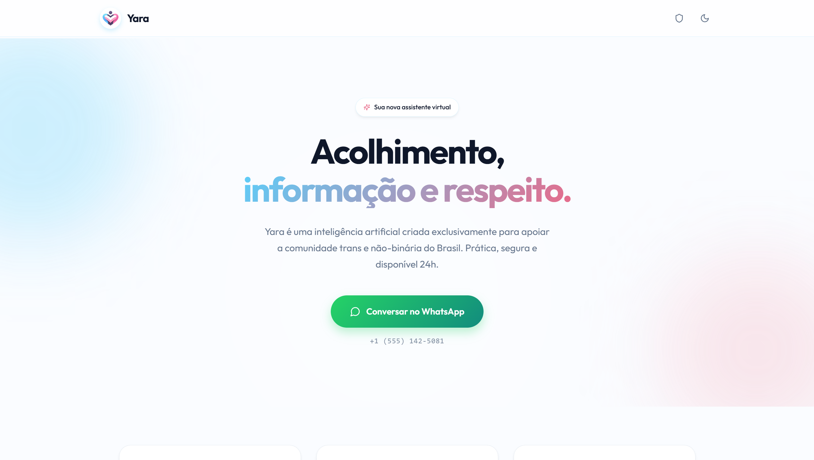

# Yara — Assistente Trans-Afirmativa 🏳️‍⚧️

Yara é uma assistente de inteligência artificial criada para e pela comunidade trans e não-binária brasileira. Ela acolhe emocionalmente e fornece informações práticas precisas sobre saúde estruturada (SUS), direitos, dicas de transição e comunidade.

O projeto é acessível via WhatsApp (onde a mágica realmente acontece, com suporte a mensagens de voz humanizadas) e possui uma Landing Page web elegante nas cores da bandeira trans para direcionamento e política de privacidade.

---

<br>

<br>

<div align="center">
  <table>
    <tr>
      <td align="center">
        
      </td>
      <td align="center">
        
      </td>
    </tr>
  </table>
</div>

<br>

<br>

---

## Estrutura do Projeto (Monorepo)

- **`backend/`**: API em FastAPI + Agente LangGraph com 25 ferramentas.
- **`backend/whatsapp/`**: Integração impecável com WhatsApp Cloud API e TTS da ElevenLabs.
- **`frontend/`**: Landing page em React + Vite.
- **`Dockerfile` mestre**: Configurado para construir o React e embuti-lo estaticamente dentro do FastAPI, permitindo um deploy unificado em um único contêiner.

---

## Como Rodar Localmente (Desenvolvimento)

Para desenvolver as duas peças em paralelo na sua máquina:

1. **Backend (API + IA)**:
   ```bash
   cd backend
   # Instale o uv (opcional, mas recomendado) e copie o .env
   cp .env.example .env
   # Instale as dependências (Requer Python 3.12+ e ffmpeg)
   uv venv -p 3.12
   uv pip install -r requirements.txt
   # Rode o servidor
   uv run python -m uvicorn main:app --reload --port 8080
   ```

2. **Frontend (Landing Page)**:
   ```bash
   cd frontend
   npm install
   npm run dev
   # Acesse http://localhost:5173 e o Vite fará reload instantâneo
   ```

---

## Como Fazer o Deploy no Google Cloud Run (Produção)

O projeto foi configurado com um `Dockerfile` de múltiplos estágios na raiz, o que significa que o Google Cloud é capaz de compilar o Node.js e o Python em um serviço único e perfeitamente amarrado.

### Passos para subir a Yara na nuvem:

1. Autentique-se no Google Cloud e defina seu projeto com faturamento ativo:
   ```bash
   gcloud config set project SEU_PROJECT_ID
   ```
2. Faça o deploy de tudo na raiz do repositório (`Yara/`):
   ```bash
   gcloud run deploy yara-service --source . --region southamerica-east1 --allow-unauthenticated
   ```
3. Acesse o console do **Cloud Run** na internet, clique em `yara-service` -> Edit & Deploy New Revision -> **Variables & Secrets**. Adicione exatamente o conteúdo do seu `.env` (chaves do Groq, WhatsApp, ElevenLabs).

---

## Configuração do Canal WhatsApp (Meta Cloud API)

A Yara pode responder textos e gerar áudios conversando diretamente pelo WhatsApp.

### 1. Criar App na Meta
1. Acesse [developers.facebook.com](https://developers.facebook.com/).
2. Crie um aplicativo do tipo **Empresa** e adicione o produto **WhatsApp**.

### 2. Cadastrar as Chaves
Colete e coloque no painel do Cloud Run (ou no seu `.env` local):
- `WHATSAPP_TOKEN`: Token de acesso real ou teste.
- `WHATSAPP_PHONE_ID`: ID do número de telefone associado.
- `WHATSAPP_VERIFY_TOKEN`: Sua senha inventada para proteger o webhook (ex: `yara`).
- `ELEVENLABS_API_KEY` e `ELEVENLABS_VOICE_ID`: Para a geração de voz via TTS (recomendado ID da Valentina ou outra voz em Português-BR).

### 3. Expor o Backend localmente (Apenas para Testes Locais)
Se estiver testando na sua máquina antes do Google Cloud, use o ngrok:
```bash
ngrok http 8080
```

### 4. Configurar Webhook na Meta
1. No painel Meta for Developers → Cliquem em WhatsApp → Configuração da API → **Webhooks**.
2. Clique em **Editar**.
3. **URL de Retorno**: `https://SUA_URL_DO_NUVEM_OU_NGROK/webhook/whatsapp`
4. **Token de Verificação**: O seu `WHATSAPP_VERIFY_TOKEN` (ex: `yara`).
5. **Dica**: Ao clicar em verificar, a Meta enviará uma requisição GET. Se você estiver usando o Postman para testar antes da Meta, não esqueça de colocar `hub.mode=subscribe`, `hub.verify_token=yara` E o `hub.challenge=112233` na URL.
6. Salve. Em "Campos de Webhook", inscreva-se (Subscribe) para o campo `messages`.

> **Magia do Áudio**: Para testar a ElevenLabs em ação, envie uma mensagem no WhatsApp com as palavras "áudio", "voz", ou "falar" (ex: *"Me manda um áudio de uma afirmação positiva pro meu humor de hoje"*).
